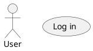
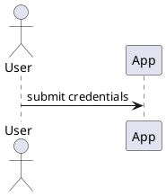

# MDD Workflow

`mdd init` bootstraps an agent-first model-driven development workspace. The public CLI intentionally stops there. Claude Code and Codex project skills drive the entire model lifecycle: mapping code, generating objectives, validating, implementing, and reviewing the loop closure.

Authoritative files:

- `.mdd/models/current/` and `.mdd/models/objective/` contain UML models written as PlantUML.
- `.mdd/constraints/` contains OCL constraints (shared across both sides; OCL references the domain ID on either side).
- `.mdd/trace.yml` contains trace links between models, tests, and source.
- `.mdd/approvals.yml` records optional review approvals for current model and constraint file hashes.

## Two-sided model layout

The workspace tracks two parallel views of the system:

- **Current** (`.mdd/models/current/`): what the codebase already does. Produced by `/mdd-map` from existing code.
- **Objective** (`.mdd/models/objective/`): what the codebase should do. Produced by `/mdd-generate` from a description.

Each side has the same six diagram-type subdirectories:

- `<side>/use-cases/` — use-case diagrams (actors, user goals, externally visible behavior).
- `<side>/sequences/` — sequence diagrams (runtime interactions, command/query/integration flows).
- `<side>/domain/` — class or object diagrams (entities, value objects, relationships, invariants referenced by OCL).
- `<side>/components/` — component diagrams (packages, services, deployable units, adapters, ownership boundaries).
- `<side>/mockups/` — PlantUML Salt mockup diagrams with UI contracts (authored by `/mdd-generate` when the description involves UI).
- `<side>/states/` — state-machine diagrams for domain classes with non-trivial lifecycle.

An `@id(USE-X)` may appear in both `current/use-cases/...` and `objective/use-cases/...` — it represents the same logical use case in two states. Validation enforces uniqueness within each side.

## Workflow cycle

Two entry points and five productive skills, plus one render utility:

```
ENTRY-A (existing code):   /mdd-map      ->  /mdd-validate  ->  /mdd-generate  -> ...
ENTRY-B (description):     /mdd-generate ->  /mdd-validate  -> ...

After /mdd-map or /mdd-generate, /mdd-validate gates progression.
When both sides are non-empty and validate is clean, /mdd-implement may run.

Implement cycle:
  /mdd-implement (writes code)
      -> /mdd-map      (refreshes current from new code)
        -> /mdd-validate
          -> /mdd-review
              | match    -> DONE  (start the next cycle)
              | mismatch -> /mdd-implement (loop)
```

`/mdd-render` is a utility: it renders any `.puml` under `.mdd/models/` to SVG on demand for external inspection. It is **not** part of the gate and does not block any other skill.

## Orchestrated entry point

`/mdd-cycle` runs the whole loop from a single description. It selects the entry point (`/mdd-generate` when a description is given, otherwise it behaves as `/mdd-map` with no comments and stops), and it **owns the cycle boundary**: it opens a numbered cycle under `.mdd/cycles/<N>/`, snapshots `.mdd/models/current/` to `before/`, loops to parity, then on review match snapshots `after/`, writes annotated `<diagram>.diff.puml` files, and closes the manifest. Standalone `/mdd-map` and `/mdd-generate` never open or close a cycle. Whenever a decision is genuinely ambiguous, `/mdd-cycle` pauses and asks the user — it never guesses. The viewer reads `.mdd/cycles/` to group diagrams by cycle and render the superposed before/after diff.

## Greenfield kickoff

`/mdd-kickoff` is the front door for a **new** project (a utility skill, outside the parity gate — it opens no cycle). It interviews the developer to objective + architecture alignment, writes a signed-off `.mdd/docs/brief.md`, runs `/mdd-generate` for the full objective model, then decomposes it into a Ralph-ready `.mdd/ralph/PLAN.md` and stops — a human launches `/mdd-ralph`. Model-bearing PLAN items carry an inline `@scope(<id>, …)` of the objective `@id`s they realize; Ralph routes each to a `/mdd-cycle` realize-slice (which closes against just that scope), and infra/tooling items (no `@scope`) run with general tools. `mdd validate` checks (as warnings) that every PLAN `@scope` id resolves to an objective id and that the `@scope` union covers every implementation-bearing objective id, so exhausting the PLAN coincides with whole-model parity. Incremental change on an existing repo still goes through `/mdd-cycle`.

## Architecture source of truth

Beside the diagrams, the **structured architectural source of truth** lives under `.mdd/architecture/`: `components.yml` (logical/deployable components, the domain `@id`s they own, dependencies, tech), `decisions.yml` (architecture decisions as data — append-only, supersede don't rewrite, so the file is the decision history), and `constraints.yml` (cross-cutting rules). `mdd init` scaffolds documented-but-empty templates (SeededOnce, never clobbered); `/mdd-kickoff` authors the initial spec from the agreed brief; thereafter any agent keeps it current when the architecture changes. The diagrams remain the visual model (with whole-map history); the spec is the authoritative *what + why* and references diagram `@id`s to stay in sync. Interim change history is git; a structured `mdd arch diff`/`status` verb (reusing the snapshot/diff machinery, runnable detached from a cycle) is a planned follow-up. The agent how-to is `.mdd/docs/architecture-tracking.md` (`OCL-ARCH-*` invariants in `.mdd/constraints/architecture.ocl`).

## Whole-map baseline

`/mdd-cycle` keeps a project-wide **whole-map** under `.mdd/map/` — a per-concept picture of the whole system that grows cycle by cycle. It is maintained only by the cycle **Close** step: after the cycle's `<diagram>.diff.puml` files are written, that cycle's `CycleDiff` is folded into `.mdd/map/<kind>/<name>.puml` (added `@id`s copied in from `after/` and tagged with a `' @cycle(<ID>, <N>)` provenance line, removed `@id`s deleted, unchanged ones keeping their earlier provenance). It is never re-derived from code and there is no `/mdd-map` "whole" mode; accumulation is one cheap diff application per cycle, so an element added by one cycle and removed by a later one nets to **neither** (no `<<removed>>` ghost, unlike a single cycle's `.diff.puml`). `.mdd/map/manifest.yml` records `version`, `last_cycle`, `generated_at`, and `files`. The whole `.mdd/map/` tree is snapshotted into `.mdd/cycles/<N>/whole/` at close so the picture *as of cycle N* is recoverable, and `/mdd-render` rasterizes `.mdd/map/**.puml` to `.mdd/rendered/map/**.svg`.

The whole-map is an inspection artifact **outside the parity gate**: `/mdd-validate`, `/mdd-review`, and the `/mdd-cycle` parity loop never read or gate on `.mdd/map/`. The `OCL-MAP-*` constraints in `.mdd/constraints/whole-map.ocl` describe the artifact's invariants but are not parity checks. Greenfield (no closed cycle) means no `.mdd/map/` tree at all.

## ID And Ref Conventions

Every PlantUML model file must contain at least one stable`@id(...)` marker. Significant model elements should also have IDs when they need traceability, review, testing, or implementation links.

Use readable prefixes:

- `USE-...` for use cases.
- `SEQ-...` for sequences.
- `DOM-...` for domain concepts.
- `CMP-...` for components.
- `STM-...` for state machines.
- `MCK-...` for mockups.
- `UIC-...` for UI contract elements.
- `UIT-...` for generated UI tests.
- `OCL-...` for constraints.
- `AT-...` for acceptance tests.

Use `@ref(...)` when a diagram or OCL constraint depends on another model ID. **Refs resolve within the same side**: a current-side `@ref(USE-X)` must point to a current-side `USE-X`; an objective-side `@ref(USE-X)` must point to an objective-side `USE-X`. OCL constraints may reference domain IDs on either side.

Examples:





```ocl
-- @id(OCL-USER-EMAIL-REQUIRED)
-- @ref(DOM-USER)
context User
inv EmailRequired: self.email <> ''
```

PlantUML Salt mockups use `@startsalt` and structured UI contract comments:


## Trace Rules

`.mdd/trace.yml` uses durable trace links:

```yaml
version: 1
links:
  - from: USE-LOGIN
    to: SEQ-LOGIN
    relation: realizes
generated_tests:
  - id: AT-USE-LOGIN
    path: .mdd/tests/acceptance/use-login.feature
    model_id: USE-LOGIN
generated_ui_tests:
  - id: UIT-MCK-LOGIN-FORM
    path: .mdd/tests/ui/mck-login-form.spec.ts
    model_id: MCK-LOGIN-FORM
    framework: playwright
source_links:
  - model_id: DOM-USER
    path: src/domain/user.rs
    symbol: User
```

Additional relations used by state-machine diagrams:

```yaml
links:
  - from: STM-USER-LIFECYCLE
    to: DOM-USER
    relation: models_lifecycle_of
  - from: USE-LOGIN
    to: STM-USER-LIFECYCLE
    relation: triggers_transition
```

Rules:

- Every link must reference existing `@id(...)` values. A link may cross sides (e.g. an objective USE that ties to a current SEQ) but typically both endpoints live in the same side.
- Every use case intended for implementation should trace to at least one sequence diagram.
- Every state-machine diagram is linked to the domain class whose lifecycle it describes with `relation: models_lifecycle_of`. Each use case or skill that drives a transition in the state machine is linked with `relation: triggers_transition`.
- `generated_tests` must point to existing acceptance test files.
- `generated_ui_tests` must point to existing Playwright spec files and reference mockup IDs.
- `source_links` must point to existing source files and should include a symbol when practical.
- When code moves, update source links in the same change.

## Validation Checklist

`/mdd-validate` runs the deterministic gate `mdd validate` (engine: `Project::validate()`; `--json` emits a slim `{ok, errors, warnings}` object) rather than re-deriving the checks by hand. It is independent of `mdd review` — it never runs the parity gate. The command walks both `.mdd/models/current/` and `.mdd/models/objective/` and checks:

- UML and PlantUML files are in `.mdd/models/current/<kind>/` or `.mdd/models/objective/<kind>/`.
- Every PlantUML model has at least one `@id(...)`.
- IDs are unique **within the same side**. The same ID may appear in current and objective (it represents the same logical model in different states).
- Every `@ref(...)` resolves: current-side refs to current-side IDs; objective-side refs to objective-side IDs. OCL files may reference domain model IDs in either side.
- OCL constraints live under `.mdd/constraints/` and reference domain model IDs.
- Mockup files under `<side>/mockups/` include at least one `MCK-...` ID.
- UI contract element IDs from `@ui-element(...)` are unique `UIC-...` IDs across the workspace.
- Implementation-ready mockups (those with `@ui-route(...)` and at least one `@ui-element(...)`) have generated Playwright UI tests linked in `generated_ui_tests`.
- State-machine files under `<side>/states/` include at least one `STM-...` ID and exactly one `@ref(DOM-...)`.
- Every `@sec(...)` marker parses, declares a stereotype in the active catalog (currently `ByPassing`, `Encrypt`, `BufferOverflow`, `SqlInjection`, `Flooding`, `Expiration`), has a `host=` that resolves to a same-side `@id(...)` in the same file on a host kind the stereotype accepts, and supplies the tagged values its stereotype requires (see `.mdd/docs/security-profile.md`). Unknown stereotypes fail validation.
- Trace links in `.mdd/trace.yml` reference existing IDs and every use-case ID traces to at least one sequence ID.
- Acceptance tests that exist are linked in trace data.
- Approval hashes in `.mdd/approvals.yml` match the current model and constraint files when review metadata is present.

Validation errors block the next skill until fixed. Missing or stale approvals, rendered SVGs, and acceptance-test coverage are readiness warnings; report them and continue unless the user asks to pause.

## Review Closure

`/mdd-review` runs after `/mdd-implement -> /mdd-map -> /mdd-validate` and performs **two passes**; the cycle closes only when both are satisfied (`Project::review()` computes the combined gate).

**Pass 1 — ID parity.** Compare the current and objective `@id` sets:

- **Match** (no missing IDs): ID parity is satisfied.
- **Mismatch** (one or more objective IDs absent from current): annotated `.diff.puml` files are written under `.mdd/rendered/review/<diagram>.diff.puml` (missing in green `<<missing>>`, extras in red `<<extra>>`). Hand off back to `/mdd-implement`.

**Pass 2 — security parity.** Diff `@sec(...)` markers (keyed by host + stereotype + sorted params, excluding `id=SEC-...`) between objective and current. A **missing security marker** means the objective requires a guard the current (code-derived) side does not enforce. Behavior depends on `.mdd/config.yml` `security.parity_check`:

- **`error` (default — security-by-default)**: a missing security marker blocks cycle closure exactly like an ID mismatch.
- **`warn`**: missing markers are reported and `.mdd/rendered/review/<diagram>.security.diff.puml` is written, but they do not by themselves block closure (opt-down).

**Closure rule**: the cycle is complete only when ID parity matches **and** (security parity matches **or** `security.parity_check` is `warn` and the user accepts the warnings). The user may override a mismatch manually if a particular extra or missing element is intentional.

## Rendering On Demand

`/mdd-render` produces SVGs under `.mdd/rendered/<source-path>.svg` for any PlantUML file. Use the packaged PlantUML jar where available:

```bash
java -jar path/to/plantuml.jar -tsvg -pipe < .mdd/models/current/use-cases/example.puml > .mdd/rendered/models/current/use-cases/example.svg
```

PlantUML needs Graphviz `dot` for graph-based UML diagrams (use-case, class, object, component, deployment, state, and legacy activity diagrams). If `dot` is installed outside PATH, set `GRAPHVIZ_DOT=/path/to/dot`.

Rendering reports any PlantUML diagnostic text (`Dot executable does not exist`, `Cannot find Graphviz`, `Syntax Error`, `Error`, `No diagram found`) but does not block any workflow step. The user reviews SVGs in an external editor.

## Review Readiness (optional approval)

Approval is explicit user confirmation of the **current** models and constraints. After the user approves, update `.mdd/approvals.yml` with `approved: true`, an `approved_at` timestamp, and the SHA-256 hash of every `.puml`, `.plantuml`, `.uml`, and `.ocl` file under `.mdd/models/current/` and `.mdd/constraints/`.

Implementation readiness is reported from:

- structural validation errors;
- `.mdd/approvals.yml` freshness;
- affected use-case acceptance tests under `.mdd/tests/acceptance/`;
- affected UI mockup Playwright tests under `.mdd/tests/ui/`;
- `.mdd/trace.yml` links between models, tests, and source for the requested change.

Structural validation errors should be fixed before implementation. Missing or stale approvals and acceptance tests are readiness warnings; report them and continue unless the user asks to pause.
