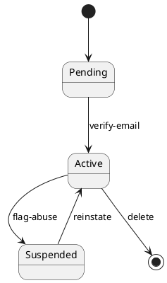

# UML And OCL Guide

Use PlantUML for UML diagrams and OCL for constraints. The goal is not exhaustive modeling; it is durable, reviewable intent that agents can validate before coding.

The workspace has two sides — `current/` (what the code does) and `objective/` (what the code should do) — and every diagram type below may live in **either side** under `.mdd/models/<side>/<kind>/`. The path examples in each section use `<side>`; substitute `current` or `objective` based on the skill writing the file (`/mdd-map` writes to `current/`, `/mdd-generate` writes to `objective/`).

## Use-Case Diagrams

Place use-case diagrams in `.mdd/models/<side>/use-cases/`. Each file should include actors, externally visible goals, and one or more stable `@id(...)` markers. Use `USE-...` IDs.

Keep use cases user-centered. Avoid encoding implementation steps that belong in sequence diagrams.

## Sequence Diagrams

Place sequence diagrams in `.mdd/models/<side>/sequences/`. Each use case intended for implementation should have at least one sequence diagram with an `@id(...)` and an `@ref(...)` to the use-case ID it realizes (same side).

Show important participants, calls, events, alternate flows, and failure paths. Avoid drawing every private helper call.

## Domain Diagrams

Place domain diagrams in `.mdd/models/<side>/domain/`. Use class or object diagrams for entities, value objects, services with domain meaning, relationships, multiplicities, and important attributes. Domain IDs use `DOM-...`.

OCL constraints should reference domain IDs, so keep domain model names stable and aligned with the ubiquitous language of the repository.

## Component Diagrams

Place component diagrams in `.mdd/models/<side>/components/`. Use these for packages, services, adapters, UI shells, persistence layers, external systems, and deployable units. Component IDs use `CMP-...`.

Component diagrams should make ownership and dependencies clear enough for implementation planning.

## State Machine Diagrams

Place state-machine diagrams in `.mdd/models/<side>/states/`. Use them when a domain class has non-trivial lifecycle behavior — three or more reachable states, transitions guarded by external events, or staleness and approval semantics that use-case `<<gates>>` arrows cannot express crisply. State-machine IDs use `STM-...` and must reference exactly one domain class via `@ref(DOM-...)`.

PlantUML syntax:



Transition labels should name the trigger that causes the transition — a use-case ID, a skill name, or a domain event — so the diagram is the canonical record of what drives each state change. Keep state names user-meaningful (`Approved`, `StaleAfterEdit`) rather than implementation-internal.

Link the state machine in `.mdd/trace.yml` with `relation: models_lifecycle_of` from `STM-...` to its `DOM-...`, and with `relation: triggers_transition` from each named use case or skill to the `STM-...`.

## Mockup Diagrams

Place PlantUML Salt mockups in `.mdd/models/<side>/mockups/` (typically `objective/mockups/`, since UI mockups are authored by `/mdd-generate` from a description). Mockup IDs use `MCK-...`, UI contract element IDs use `UIC-...`, and generated UI tests use `UIT-...`.

Mockups should reference the use case or sequence they support with `@ref(...)` (same side). Use structured comments to define route, viewport, roles, accessible names, required states, and primary actions:

```plantuml
@startsalt
' @id(MCK-CHECKOUT-FORM)
' @ref(USE-CHECKOUT)
' @ui-route(/checkout)
' @ui-viewport(desktop,1280,720)
' @ui-element(UIC-CHECKOUT-SUBMIT, role=button, name="Submit order", required=true)
{
  [Submit order]
}
@endsalt
```



Mockups with both `@ui-route(...)` and at least one `@ui-element(...)` are implementation-ready and must have a generated Playwright spec linked from `.mdd/trace.yml` under `generated_ui_tests`.

## OCL Constraints

Place OCL files in `.mdd/constraints/` (shared across sides). Each constraint file should include `@id(...)` for important constraints and `@ref(...)` to the domain model ID it constrains. The `@ref(DOM-...)` may resolve in either side; typically OCL constrains the current-side domain model since OCL describes runtime invariants.

Example:

```ocl
-- @id(OCL-ORDER-TOTAL-NONNEGATIVE)
-- @ref(DOM-ORDER)
context Order
inv TotalNonNegative: self.total >= 0
```

Reference rules:

- OCL `context` names must match domain model concepts.
- OCL files should not reference use-case, sequence, or component IDs as their primary constrained element.
- If a constraint supports a use case, express that through `.mdd/trace.yml` trace links instead of replacing the domain `@ref(...)`.

## PlantUML Notes

Use comments for IDs and refs so diagrams remain valid PlantUML:

```plantuml
' @id(DOM-USER)
' @ref(USE-LOGIN)
```

Keep aliases stable when other diagrams or notes refer to them. Prefer readable labels and explicit relationships over hidden inference.

## Security Stereotypes

Security-sensitive use cases, sequences, classes, and components carry inline UML stereotypes plus `@sec(...)` comment markers that record tagged values. The marker must live in the same file as the `@id(...)` it references via `host=`. The full profile, per-stereotype tagged-value contracts, and accepted host kinds live in `.mdd/docs/security-profile.md`. `SEC-...` (security requirement / annotation host) and `THR-...` (misuse case / threat) are reserved ID prefixes; SEC- IDs follow the same per-side uniqueness rule as other `@id(...)` values.

The active stereotypes (Peralta OWASP-derived catalog):

- `<<ByPassing>>` — access-control bypass (host: actor or use case).
- `<<Encrypt>>` — field or channel encryption (host: class or sequence participant).
- `<<BufferOverflow>>` — bounded-input length guard (host: class).
- `<<SqlInjection>>` — bound SQL parameter with sanitizer (host: class).
- `<<Flooding>>` — rate or concurrency limit (host: use case or component).
- `<<Expiration>>` — session/token TTL (host: class).

Example on a use case:

```plantuml
@startuml
' @id(USE-CHANGE-BOOK-PRICE)
' @sec(stereotype=ByPassing, host=USE-CHANGE-BOOK-PRICE, link=/admin/books, allowed=Admin, denied=Anonymous|Customer, id=SEC-ADMIN-PRICE-GUARD)
usecase "Change book price" as ChangePrice <<ByPassing>>
@enduml
```



Example on a domain class with a bounded-input field:

```plantuml
@startuml
' @id(DOM-USER-INPUT)
' @sec(stereotype=BufferOverflow, host=DOM-USER-INPUT, field=email, max_length=254, id=SEC-EMAIL-LEN)
class UserInput <<BufferOverflow>> {
  + email : String
}
@enduml
```



## Consistency Rules

- Every significant behavior starts in a use case.
- Every use case intended for implementation traces to a sequence.
- UI-facing behavior should have a Salt mockup when route, layout, or accessible interaction contracts matter — authored by `/mdd-generate` into `.mdd/models/objective/mockups/`.
- Domain behavior with invariants has OCL constraints.
- Components that own behavior are linked through trace data.
- Security-sensitive behavior carries `@sec(...)` markers per the security profile.
- Validation errors should be fixed before implementation; readiness warnings (rendering, approvals, acceptance-test gaps) do not block.
- Refs resolve **within the same side**: never write a `@ref(USE-X)` inside `current/` and expect it to resolve to an objective `USE-X`.
